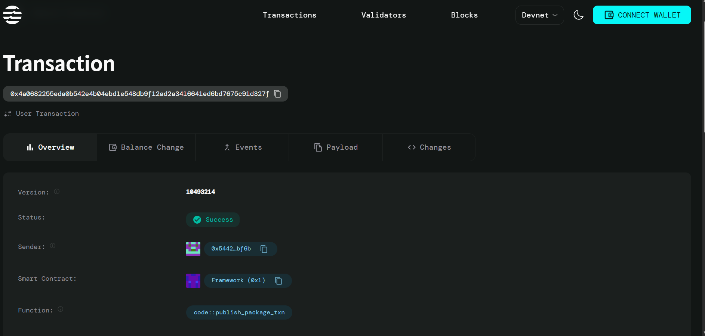

# Leaderboard Contract

## Project Description

The Leaderboard Contract is a decentralized smart contract built on the Aptos blockchain that enables the creation and management of competitive leaderboards. This contract allows users to track and rank player performances across various games, competitions, or activities in a transparent and immutable manner. Players can submit their scores, and the contract maintains a comprehensive leaderboard that reflects real-time rankings and achievements.

## Project Vision

Our vision is to revolutionize competitive gaming and achievement tracking by providing a decentralized, transparent, and tamper-proof leaderboard system. We aim to create a trustless environment where players can compete fairly, showcase their skills, and have their achievements permanently recorded on the blockchain. This system eliminates the possibility of score manipulation and provides a universal ranking system that can be integrated across multiple platforms and games.

## Key Features

- **Decentralized Score Tracking**: All scores and rankings are stored on the Aptos blockchain, ensuring transparency and immutability
- **Player Registration**: Simple player registration system with customizable usernames
- **Score Management**: Players can submit and update their scores with automatic ranking calculation
- **Transparent Rankings**: Public leaderboard that anyone can query and verify
- **Anti-Tampering**: Blockchain-based storage prevents score manipulation and cheating
- **Multi-Game Support**: Single contract can manage leaderboards for multiple games or competitions
- **Real-Time Updates**: Instant score updates and ranking recalculation
- **Permanent Records**: All achievements are permanently stored and cannot be deleted or modified maliciously

## Future Scope

### Phase 1: Enhanced Features
- **Tournament Mode**: Support for time-limited competitions with automatic winner selection
- **Category-Based Leaderboards**: Multiple leaderboards for different game modes or difficulty levels
- **Achievement System**: Unlock and track special achievements and milestones
- **Reward Distribution**: Automatic token distribution to top performers

### Phase 2: Advanced Functionality
- **Team Leaderboards**: Support for team-based competitions and group rankings
- **Historical Data**: Track performance trends and historical statistics
- **Integration APIs**: Developer-friendly APIs for easy integration with external games
- **Mobile SDK**: Native mobile development kit for smartphone games

### Phase 3: Ecosystem Development
- **Cross-Chain Compatibility**: Expand to other blockchain networks
- **NFT Integration**: Convert achievements and top rankings into collectible NFTs
- **Governance Token**: Community-driven governance for leaderboard parameters
- **Gaming Partnerships**: Strategic partnerships with game developers and esports organizations

### Phase 4: Enterprise Solutions
- **Corporate Competitions**: Enterprise-level solutions for company tournaments
- **Educational Integration**: Integration with educational platforms for academic competitions
- **Analytics Dashboard**: Advanced analytics and insights for performance tracking
- **Compliance Tools**: Regulatory compliance features for different jurisdictions

## Contract Details
0x4a0682255eda0b542e4b04ebd1e548db9f12ad2a3416641ed6bd7675c91d327f

